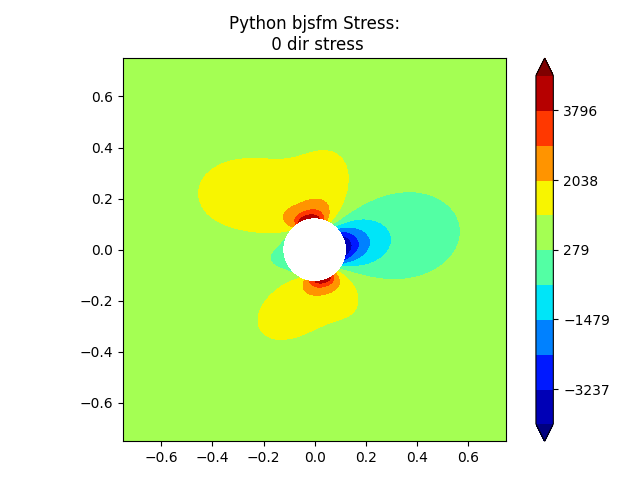

.. toctree::
   :maxdepth: 2
   :hidden:

   api
   dev

Quick Start
===========

Bolted Joint Stress Field Model (BJSFM) is a common analytical method used to analyze bolted joints in composite
airframe structures. This project ports the original fortran code to pure python code using the underlying theory.

Installation
------------

``pip install bjsfm``

Usage
-----

All examples below use the following inverse A-matrix (from CLPT). ::

    import numpy as np
    # material matrix
    a_inv = np.linalg.inv(np.array(
        [[988374.5, 316116.9, 0.],
         [316116.9, 988374.5, 0.],
         [0., 0., 336128.8]]
    ))

Create infinite plates with holes, loaded with bearing and bypass. ::

    from bjsfm.lekhnitskii import UnloadedHole, LoadedHole
    t = 0.1152  # laminate thickness [in]
    d = 0.25  # diameter [in]
    bypass = [100., 50., 25.]  # [Nx, Ny, Nxy] lb/in
    bearing = 100.  # bearing force [lb]
    alpha = 25.  # bearing angle [deg]
    byp = UnloadedHole(bypass, d, t, a_inv)
    brg = LoadedHole(bearing, d, t, a_inv, theta=np.deg2rad(alpha))

Obtain stresses from the plates and combine. ::

    step = 0.015  # characteric distance [in]
    num_pnts = 100
    r = np.array([d/2 + step] * num_pnts)
    theta = np.linspace(0, 2 * np.pi, num=num_pnts, endpoint=False)
    x = r * np.cos(theta)
    y = r * np.sin(theta)
    byp_stress = byp.stress(x, y)
    brg_stress = brg.stress(x, y)
    total_stress = byp_stress + brg_stress
    # use total stress for failure calculations ...

Plot the combined stresses. ::

    from bjsfm import plotting
    plotting.plot_stress(brg, byp)

Contribute
----------

- Issue Tracker: https://github.com/BenjaminETaylor/bjsfm/issues
- Source Code: https://github.com/BenjaminETaylor/bjsfm

Support
-------

benjaminearltaylor@gmail.com

License
-------

This project is licensed under the MIT license.

Indices and tables
==================

* :ref:`genindex`
* :ref:`modindex`
* :ref:`search`
